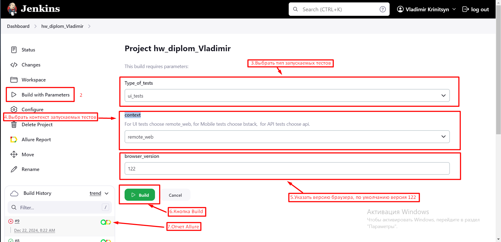
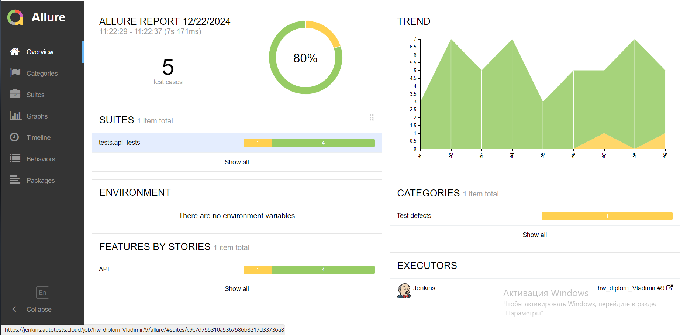
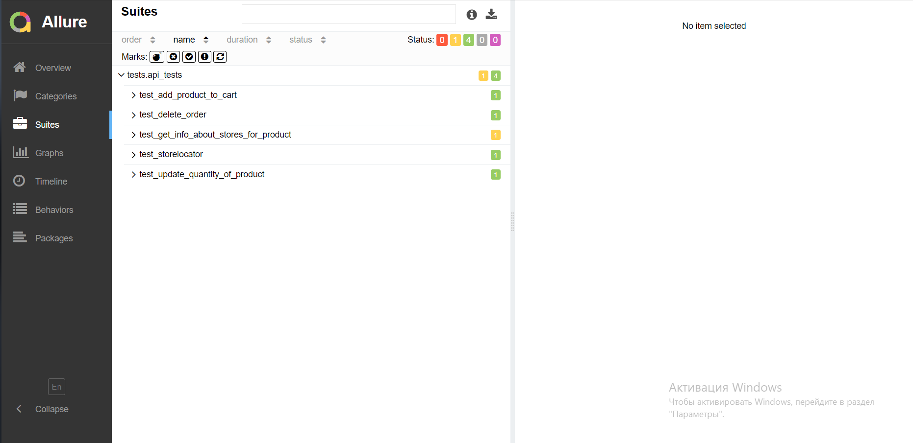
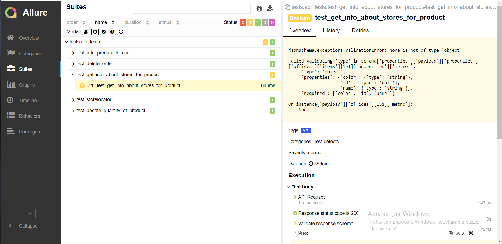
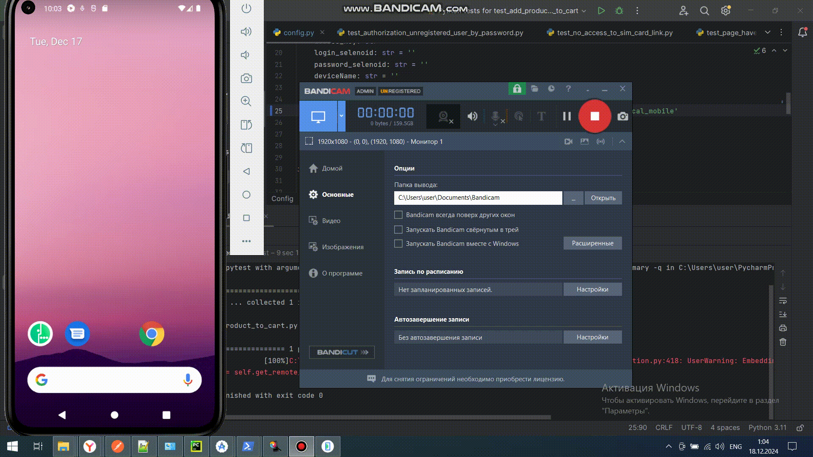
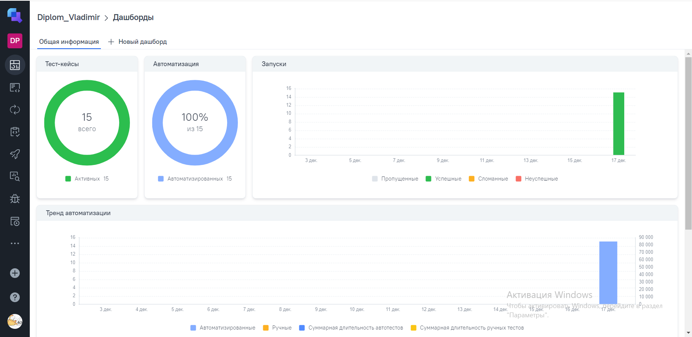
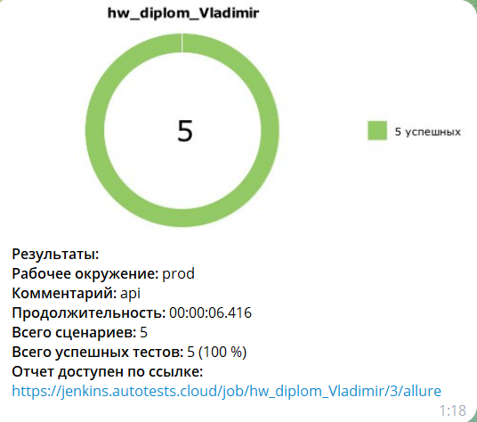
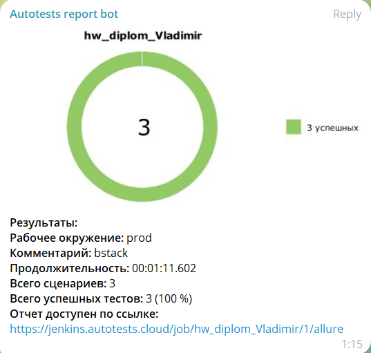

<h1> Проект Web/Api/Mobile тестирования "Мегафон"  </h1>

> <a target="_blank" href="https://spb.shop.megafon.ru/">Megaphone</a>

<!-- Технологии -->

### Используемые технологии

   <code></code>
  <code></code>
  <code></code>
  <code></code>
  <code></code>
   <code></code>
   <code></code>
   <code></code>
  <code></code>
  <code></code>
  <code></code>
  <code></code>
  <code></code>

<!-- Тесты -->
UI:

* ✅ Add product to cart
* ✅ Delete product from cart
* ✅ Filter smartphone by name iphone
* ✅ Information about contacts
* ✅ Main page header
* ✅ Private individuals services links
* ✅ Search by name iphone

Mobile:

* ✅ No access to sim card link
* ✅ Page have choices sim cards
* ✅ Authorization unregistered user by password

API:

* ✅ Delete order
* ✅ Add product to cart
* ✅ Get info about stores for product
* ✅ Storelocator
* ✅ Update quantity of product

<!-- Jenkins -->

###  Запуск проекта в Jenkins

### [Задача в jenkins](https://jenkins.autotests.cloud/job/hw_diplom_Vladimir/)

#### Для запуска автотестов в Jenkins

1. Открыть <a target="_blank" href="https://jenkins.autotests.cloud/job/hw_diplom_Vladimir/">Проект в Jenkins</a>
2. Выбрать пункт `Build with Parameters`
3. Выбрать тип запускаемых тестов в выпадающем списке Type_of_tests(ui, api, mobile)
4. Выбрать контекст запускаемых тестов в выпадающем списке context(remote_web, bstack, api)
5. Указать версию браузера, по умолчанию стоит 122
6. Нажать кнопку `Build`
7. Результат запуска сборки можно посмотреть в отчёте Allure

<!-- Allure report -->

###  Allure report

##### Результаты выполнения тестова можно посмотреть в Allure-отчете

    Отчет позволяет получить общую информацию оп прохождении тестов

    Отчет позволяет получить информацию о прохождении каждого теста

    Отчет позволяет получить детальную информацию по все шагам тестов, включая скриншоты, 
log - файлы и видео о прохождение теста(набор атач файлов зависит от типа тестов), а так 
же позволяет оперативно понять причину падения теста.

##### Видео прохождение  ui теста (Добавление товара в корзину)

##### Видео прохождение  mobile теста (Авторизация незарегестрированного пользователя)

<!-- Allure TestOps -->

###  Интеграция с Allure TestOps

### [Dashboard](https://allure.autotests.cloud/project/4530/dashboards)

Дашборд с результатами о прохождении тестов.

<!-- Telegram -->

###  Оповещения в Telegram

##### После выполнения тестов, в Telegram bot приходит сообщение с графиком и информацией о тестовом прогоне.

Уведомление телеграмм с результатами о прохождении UI тестов.

    
Уведомление телеграмм с результатами о прохождении API тестов.

Уведомление телеграмм с результатами о прохождении MOBILE тестов.